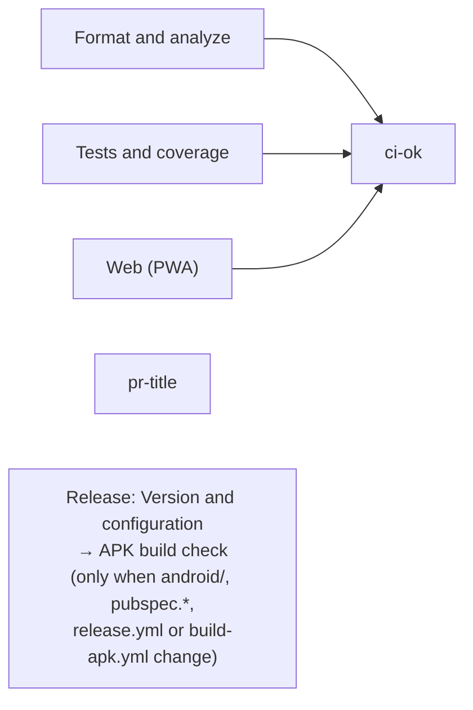
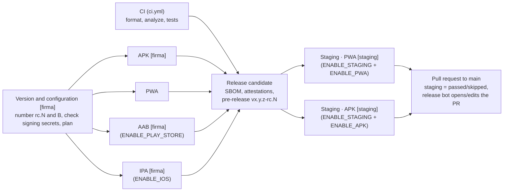
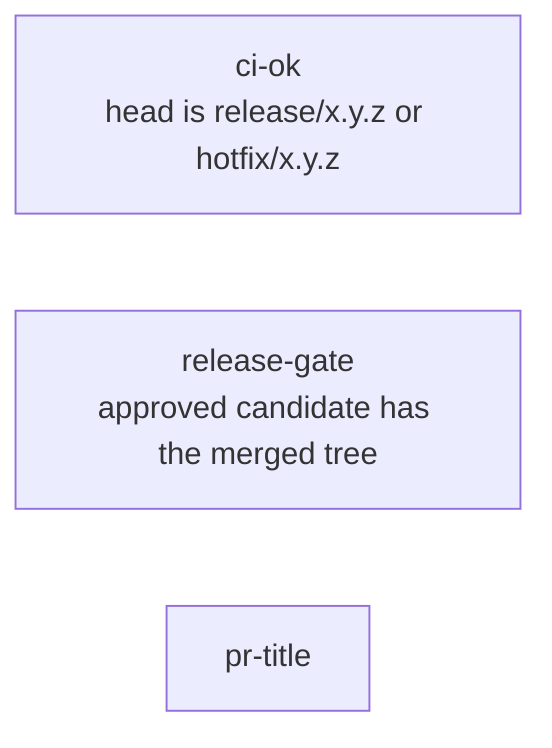
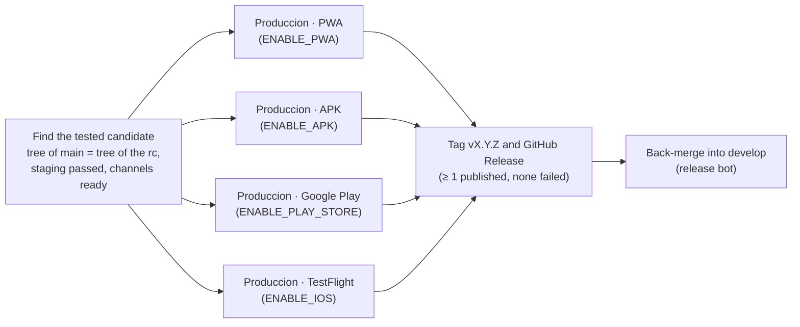

# Release pipeline

**Build once, test the candidate on staging, publish the same files from `main`, tag at the end.** This is Gitflow with release candidates (model C, «tag at the end», of the team's release strategy):

- **Every commit is tested once.** [`ci.yml`](../.github/workflows/ci.yml) tests pull requests into `develop` and the pushes to `develop`; on a release branch, `release.yml` calls it on the candidate's commit. A pull request into `main` is not tested again: `release-gate` proves that it merges exactly that tested, approved candidate.
- A push to `release/x.y.z` or `hotfix/x.y.z` runs [`release.yml`](../.github/workflows/release.yml). It tests the commit, builds every file **once**, stores them as the **release candidate** `vx.y.z-rc.N` (a GitHub pre-release, with an SBOM and attestations), deploys that candidate to **staging** after an approval, and opens the pull request `release: x.y.z` to `main` as the release bot.
- Merging that pull request runs [`produccion.yml`](../.github/workflows/produccion.yml) on `main`. It finds the candidate that was approved and publishes **its files, without rebuilding**, to **produccion** after an approval. Only when at least one channel was published and none failed does it create the tag and GitHub Release `vx.y.z`; then it opens the back-merge pull request to `develop`.
- [`rollback.yml`](../.github/workflows/rollback.yml) puts the files of an earlier `vx.y.z` back in produccion.
- `develop` deploys nothing.

```mermaid
flowchart LR
  F["feature/* · bugfix/*"] -->|"PR + CI (ci-ok)"| D[develop]
  D -->|"branch"| R["release/x.y.z"]
  M0[main] -->|"branch"| H["hotfix/x.y.z"]
  R & H -->|"push"| CI["CI on the commit<br/>(tested once)"]
  CI --> B["build once<br/>APK · PWA · AAB · IPA"]
  B --> C["pre-release vx.y.z-rc.N<br/>assets + SBOM + SHA256SUMS,<br/>attested"]
  C --> S{{"staging<br/>approval"}}
  S -->|"QA finds a bug: fix on the branch"| R
  S -->|"passed"| P["PR release: x.y.z → main<br/>(release bot)"]
  P --> G{"release-gate:<br/>approved rc with<br/>the merged tree?"}
  G -->|"no"| X["blocked: build and<br/>approve a new rc"]
  G -->|"yes, merge"| M[main]
  M --> Q{{"produccion<br/>approval"}}
  Q -->|"≥ 1 channel published,<br/>none failed"| V["tag + GitHub Release vx.y.z"]
  V --> BM["PR main → develop<br/>(release bot, auto-merge)"]
  Q -->|"a channel failed,<br/>or every channel off"| RR["no tag; re-run failed jobs<br/>(same candidate)"]
```



## Workflows
| Workflow | Runs on | What it does | Required check |
|---|---|---|---|
| [`ci.yml`](../.github/workflows/ci.yml) | Pull requests; push to `develop`; called by `release.yml` | `Format and analyze`, `Tests and coverage`, `Web (PWA)` (skipped when `release.yml` calls it with `build-pwa: false`), then `ci-ok`. On pull requests into `main` only `ci-ok` runs: it checks that the head is `release/x.y.z` or `hotfix/x.y.z` | `ci-ok` (`develop` and `main`) |
| [`pr-title.yml`](../.github/workflows/pr-title.yml) | Pull requests | The title is a Conventional Commit (`type(scope): summary`); a squash merge makes it the commit on `develop` | `pr-title` |
| [`release-gate.yml`](../.github/workflows/release-gate.yml) | Pull requests into `main` (opened, edited, synchronize, reopened) | [Release gate](#release-gate) | `release-gate` (`main`) |
| [`release.yml`](../.github/workflows/release.yml) | Push to `release/**`, `hotfix/**`; pull requests (not into `main`) that change `android/`, `pubspec.*`, `release.yml` or `build-apk.yml` | Candidate, staging and the pull request to `main`; on pull requests only a debug-signed `APK build check` | — |
| [`produccion.yml`](../.github/workflows/produccion.yml) | Push to `main` | Produccion of the approved candidate, tag at the end, back-merge | — |
| [`rollback.yml`](../.github/workflows/rollback.yml) | Manual, from `main` | Republish an earlier final release | — |
| [`build-apk.yml`](../.github/workflows/build-apk.yml), [`build-web.yml`](../.github/workflows/build-web.yml) | Called by the workflows above | The universal APK; the PWA | — |
| [`osv-scanner.yml`](../.github/workflows/osv-scanner.yml) | Weekly, manual, pull requests that change `pubspec.*` | Known vulnerabilities of `pubspec.lock` | — |

Every third-party action is pinned by its full commit SHA (with the version in a comment); Dependabot proposes the updates weekly (pub, Gradle in `/android`, GitHub Actions). Workflows grant `GITHUB_TOKEN` nothing by default and each job asks only for what it needs; checkouts never keep the token (`persist-credentials: false`), and every secret is read only by the step that uses it.

## Channels × stages × switches
| Channel | Candidate asset (built once) | Staging (`staging`, approval) | Produccion (`produccion`, approval) | Switch |
|---|---|---|---|---|
| **PWA** (web app, [WEB_PWA.md](WEB_PWA.md)) | `te-tengo-pwa.tar.gz`: `flutter build web --base-href /` with the Firebase web config, plus `deploy/pwa/_headers` and `robots.txt` (reusable [`build-web.yml`](../.github/workflows/build-web.yml)) | `Staging · PWA`: Pages project `te-tengo-app`, alias `staging`, <https://staging.te-tengo-app.pages.dev> | `Produccion · PWA`: `te-tengo-app` production (branch `main`), <https://app.tetengo.reqsai.tech> | `ENABLE_PWA` |
| **APK** (sideload, [RELEASE_ANDROID.md](RELEASE_ANDROID.md#sideload-distribution-no-play-store)) | `te-tengo.apk` + `te-tengo.apk.sha256`: the universal APK signed with the release key in the environment `firma` (reusable [`build-apk.yml`](../.github/workflows/build-apk.yml)); built for every candidate | `Staging · APK`: R2 `te-tengo-descargas/staging/te-tengo.apk` | `Produccion · APK`: R2 `te-tengo-descargas/te-tengo.apk`, the landing's download | `ENABLE_APK` |
| **Google Play**, internal testing track | `te-tengo.aab`, only when the switch is on | — | `Produccion · Google Play (internal)`: uploads **the same AAB** | `ENABLE_PLAY_STORE` |
| **TestFlight** (iOS) | `te-tengo.ipa` on `macos-26`, only when the switch is on | — | `Produccion · TestFlight`: uploads **the same IPA** | `ENABLE_IOS` |
| *(every channel)* | — | the whole stage | — | `ENABLE_STAGING` |
| **SBOM** | `te-tengo-sbom.spdx.json`: SPDX list of the Dart (`pubspec.lock`) and Swift (`Package.resolved`) packages, made by `anchore/sbom-action`; always | — | — (travels to the final release) | — |

Smoke checks after each deploy:
- **PWA:** `GET <url>/` answers `200` and `<url>/version.json` has this build's version and build number, retried for 2 minutes.
- **APK:** `HEAD <DESCARGAS_BASE_URL>/<key>` answers `200` with the APK's size, and the public `.sha256` equals the uploaded one.
- **Google Play** and **TestFlight:** the upload itself; TestFlight waits until App Store Connect has processed the build.

## The release candidate
- **What it is.** The GitHub **pre-release** `vx.y.z-rc.N`, created by the `Release candidate` job on the release commit (the tag `vx.y.z-rc.N` points to it). Its assets are every file built by that run, plus `SHA256SUMS`. Run artifacts expire (they are kept 7 days here, only to hand the files to that job); pre-releases do not.
- **Its notes** give the branch, the commit SHA, the git tree (`git rev-parse HEAD^{tree}`), the build number, the channels that were on, the APK signing certificate, the SHA-256 and size of every asset, the staging result and a link to the run. The last line is a hidden HTML comment, `<!-- te-tengo-candidata {…} -->`, with the same data as JSON, which [`candidata.sh`](../.github/scripts/candidata.sh) reads. Do not edit it.
- **Attestations.** Before creating the pre-release, the `Release candidate` job signs (Sigstore, through GitHub) a **build provenance** attestation of every file and an **SBOM** attestation of the APK, PWA, AAB and IPA. Anyone can check that a file was built by this repository's workflow from the recorded commit: `gh attestation verify te-tengo.apk --repo Te-Tengo-Tech/te-tengo-mobile-flutter`. The final release carries the same bytes, so the attestations stay valid for it.
- **N** is one more than the highest `rc` of `x.y.z` among the releases and tags. A new push to the branch builds `rc.N+1`. Older candidates are never changed or deleted.
- **Version inside.** Every file has the final version `x.y.z`: the APK and AAB `versionName`, the IPA `CFBundleShortVersionString`, the PWA `version.json`. «rc» is only the label of the pre-release, so production publishes these bytes as they are.
- **Rejected versions.** If `vx.y.z` already exists, the run fails at once: a published version never changes (SemVer rule 3), so a fix is a new version (`hotfix/x.y.(z+1)`).

### Build number
The build number `B` is Android's `versionCode`, iOS's `CFBundleVersion` and `build_number` in the PWA's `version.json`. It must **grow with every candidate**: Google Play and App Store Connect reject a build number they have already seen, and Android refuses to install an APK over a higher one.

**The pipeline computes it; nobody types it.** `Version and configuration` sets
`B = max(highest B recorded by any candidate of any version + 1, the +N of pubspec.yaml)`
and every build gets it through `--build-number` (`flutter build apk|appbundle|ipa|web`).

- **Why not bump `+N` by hand for each candidate?** Every push to the release branch (a QA fix, a merged `bugfix/*`) is a new candidate. A manual bump would need a second commit each time, and a forgotten bump would fail the run. The computed number cannot repeat and costs no commit.
- **Why not the run number?** `github.run_number` restarts if the workflow is renamed or recreated, and it is not visible to the stores. The highest recorded `B` lives in the pre-releases themselves, which are durable and public.
- **The `+N` in `pubspec.yaml` is a floor.** Leave it as it is. Raise it only to jump above a build uploaded by hand, e.g. the first AAB uploaded to Play Console. Local builds (`flutter run`, `flutter build`) keep using it.
- **Two release branches at the same time.** The `Release candidate` job checks again, just before creating the pre-release, that neither `rc.N` nor `B` was taken meanwhile. If either was, it fails and asks to re-run all jobs, which numbers the candidate again. Keep one release branch open per repository.

## Job graphs
### Pull request into `develop` (or into a release branch)

- **Required:** `ci-ok` and `pr-title`. `ci-ok` always runs and fails unless every CI job passed; a skipped or cancelled job never counts as green.
- **No secrets.** The APK build check of `release.yml` calls `build-apk.yml` without any secret, so pull request code never sees the release key, the Firebase config or the deploy tokens; the APK is signed with the runner's throwaway debug key and kept 3 days. OSV-Scanner runs when `pubspec.*` change.
- A new push to the pull request cancels the run it supersedes.

### Push to `develop`
`ci.yml` runs again on the merged commit (`Format and analyze`, `Tests and coverage`, `Web (PWA)`, `ci-ok`). It keeps `develop`'s head checked and refreshes the Flutter and pub caches that pull requests read. Nothing is deployed.

### Push to `release/x.y.z` or `hotfix/x.y.z` (`release.yml`)

- **Tested once.** The `CI` job calls `ci.yml` on this commit (`build-pwa: false`: the `PWA` job builds the candidate's own PWA, with its version and build number). `Release candidate` runs only after CI passed, so no candidate exists for an untested commit, and the pull request into `main` does not test it again.
- **The configuration is checked first.** `Version and configuration` fails, before any build, when a channel that is on lacks a signing secret or a build variable; the error names each one. It also fails when the branch name is not `release/<pubspec version>` or `hotfix/<pubspec version>`. The deploy secrets are checked later by the jobs that use them (staging, produccion), because only those jobs' environments hold them.
- **Signing in `firma`.** `Version and configuration`, `APK`, `AAB` and `IPA` run in the environment `firma`, which holds the signing secrets ([Secrets and variables](#secrets-and-variables)). `APK` and `AAB` fail when the release key is missing and a channel that publishes them (`ENABLE_APK`, `ENABLE_PLAY_STORE`) is on.
- **The plan.** It writes the plan to the run summary: each stage × channel, and either what will happen or the switch that skips it.
- **One approval for staging.** Both staging jobs need only the candidate, so they wait together and one review (*Review deployments*) approves both. Each first checks the Cloudflare secrets of the environment `staging`, then downloads the candidate's assets and checks their SHA-256 before deploying.
- **The staging result is recorded.** `Pull request to main` writes `passed` (a staging job deployed) or `skipped` (staging switched off) into the candidate's notes, with `GITHUB_TOKEN`. A failed or rejected staging job stops the run, and the candidate stays `pending`, which `release-gate` and produccion refuse.
- **Pull request to `main`.** `release: x.y.z` (`release/x.y.z` → `main`) is opened, or its description is updated, by the GitHub App **te-tengo-release-bot** ([`open-release-pr.sh`](../.github/scripts/open-release-pr.sh); [Release bot](#release-bot-github-app)). The description lists the candidate, the staging URLs, the SHA-256 of every file and the pipeline run *with its attempt*, so it always changes: the `edited` event runs `release-gate` again, which now finds the approved candidate. A later candidate also comments on the pull request.
- **Re-running.** Runs of one branch take turns (concurrency group per branch): a deploy is never cancelled, and a run that is still queued is replaced by a newer one. To let a newer run start while an older one waits for approval, reject the older one. `Release candidate` jobs of all branches take turns too, so two never pick the same `rc` or build number.

### Pull request into `main`

- **Nothing is rebuilt or retested.** The CI jobs are skipped (`ci-ok` only checks the head branch name) and `release.yml` does not run: the head commit is a candidate commit that CI already tested.
- **`release-gate` decides** ([Release gate](#release-gate)). It is red while the candidate of the head commit is being built or waits for staging, and turns green when the release bot edits the pull request after staging.
- **Required:** a review, `ci-ok`, `release-gate` and `pr-title`. Merge with a **merge commit**.

### Push to `main` (`produccion.yml`)

- **Which candidate.** `Find the tested candidate` reads `x.y.z` from `pubspec.yaml` and runs `candidata.sh buscar`, the same command as `release-gate`: the newest pre-release `vx.y.z-rc.N` whose recorded tree equals `git rev-parse HEAD^{tree}` of the `main` commit, whose staging passed (`passed`, or `skipped` because `ENABLE_STAGING` was off) and whose tag points at a commit with that tree. An older approved rc wins over a newer one with the same tree that is still pending. A merge commit of a release branch that already contains `main` has exactly the tree of the branch's last commit, so it matches.
- **When nothing matches, the run fails** («No candidate for this tree», or «No approved candidate for this tree» when the matching ones have not passed staging). The release gate makes this rare; it still happens when a commit reaches `main` without a release pull request. Bring the change into the release branch, push it to build a new rc, pass staging and merge again.
- **Every channel that is on must have been on when the candidate was built.** Otherwise its configuration was never checked and it never went through staging. The run fails before the approval and asks for a new candidate, or for the switch to be set to `false`.
- **One approval for produccion.** The four jobs need only that job, so they wait together. Each first checks its own deploy secrets (secrets of the environment `produccion`) and fails with an error naming the missing one; then it downloads its asset from the candidate, checks it against `SHA256SUMS` and publishes it: the PWA files to Pages, the APK to R2, the AAB to Google Play, the IPA to TestFlight. Nothing is compiled.
- **Tag at the end.** `Tag vX.Y.Z and GitHub Release` runs only when **no produccion job failed or was rejected and at least one succeeded** (a job skipped by its switch does not block, and does not count). It creates the GitHub Release `vx.y.z` (and its tag) on the `main` commit, with the candidate's assets (the SBOM included) and notes made of the `## [x.y.z]` section of `CHANGELOG.md`, the candidate and the checksums.
- **Every channel switched off: no tag, no back-merge.** Nothing reached production, so the version is not released; the run summary and a notice say so. Turn a channel on and re-run the run.
- **Back-merge.** `Back-merge into develop`, after the tag, runs [`back-merge.sh`](../.github/scripts/back-merge.sh) as the release bot: it opens `chore: merge release x.y.z back into develop` (`main` → `develop`) with auto-merge (merge commit) when the repository allows it, and after a hotfix also `main` → every newer open `release/*` branch, so the next release keeps the fix.
- **Partial failure.** If a channel fails (say the APK upload) or its approval is rejected, there is no tag. *Re-run failed jobs* publishes the **same** candidate again and then tags.
- **Already released.** When `vx.y.z` exists and points to the same tree, nothing runs. When it exists with another tree, the run fails: the version on `main` must be new.
- **One at a time.** Produccion and rollback share one concurrency group.

### Rollback (`rollback.yml`, manual)
*Actions → Rollback → Run workflow* from `main`, with the version `x.y.z` of an existing final release:
- `Check the release` checks that the run is on `main` and that `vx.y.z` is a final release (not a candidate) with the needed assets.
- After an approval on `produccion`:
  - `Rollback · PWA` (input `pwa`, on by default, and `ENABLE_PWA`) republishes its `te-tengo-pwa.tar.gz`;
  - `Rollback · APK` (input `apk`, off by default, and `ENABLE_APK`) republishes its `te-tengo.apk`.
  
  Both first check the Cloudflare secrets of the environment `produccion`, then the SHA-256, and run the same smoke checks.
- **No build.**
- **APK.** Android does not install an older `versionCode` over a newer one. Phones that already have the newer APK keep it, so the APK rollback only helps new installs.
- **Stores.** Google Play and TestFlight are not republished: stores take each build number once and only higher ones. Halt the release in Play Console, or expire the build in TestFlight; testers can still install an earlier TestFlight build.
- **Real fix.** Usually a `hotfix/x.y.(z+1)`.
- **Database.** The app has no database of its own. If the bad release came with an API migration, restore the API database from the backup taken before that deploy (`te-tengo-infra`) together with the rollback.

#### Rollback rehearsal
Rehearse the rollback before it is needed, at least once per release cycle and whenever `rollback.yml`, `deploy_pwa.sh` or the `produccion` environment changes. The safe rehearsal rolls the PWA back to the release that is **already live**: the same bytes are deployed again, so users see no change.
1. Find the live release: `curl -s https://app.tetengo.reqsai.tech/version.json` gives its `version` and `build_number`; it is the newest `vX.Y.Z` under *Releases*.
2. *Actions → Rollback → Run workflow*, from `main`: `version` = that `X.Y.Z`, `pwa` on, `apk` off.
3. Approve the `produccion` review. `Rollback · PWA` checks the Cloudflare secrets and the SHA-256 against the release's `SHA256SUMS`, deploys, and its smoke check waits until `version.json` serves that build.
4. Check by hand that `version.json` still shows the same `version` and `build_number`, and that the app opens.
5. Record the date, the version, the run link and the result (passed, or what failed and the fix) in the team's release log.

A rehearsal that fails has found a problem while nothing is broken: fix it before the next release. The APK rollback is rehearsed the same way (`apk` on, the live version), and only re-uploads the same file.

## Release gate
[`release-gate.yml`](../.github/workflows/release-gate.yml) is the required check `release-gate` of every pull request into `main`; it runs [`release-gate.sh`](../.github/scripts/release-gate.sh) (the same script in every Te Tengo repository) with `candidata.sh buscar` as its find-candidate command. The pull request may be merged only when:
1. it comes from `release/x.y.z` or `hotfix/x.y.z` of this repository, and `x.y.z` is the `pubspec.yaml` version of its head;
2. `vx.y.z` is not released yet;
3. GitHub's test merge puts into `main` exactly the git tree of the head (`main` has nothing the branch lacks; after a hotfix, merge `main` into the release branch first, which builds a new candidate);
4. an **approved** candidate of `x.y.z` has that tree: staging `passed` (or `skipped` by its switch).

Produccion looks for its candidate with the same command, so a green gate means `produccion.yml` will find the candidate after the merge. A push to the release branch turns the gate red until the new candidate has passed staging; the release bot's edit of the pull request then runs it again.

## Release bot (GitHub App)
Pull requests opened or edited with `GITHUB_TOKEN` start no workflows, so their required checks would never run. The release pull request (`Pull request to main`) and the back-merge pull requests (`Back-merge into develop`) are therefore opened by the GitHub App **te-tengo-release-bot**:
- the organization variable `RELEASE_APP_ID` and the organization secret `RELEASE_APP_PRIVATE_KEY`;
- each job mints a short-lived token with `actions/create-github-app-token`, limited to what it needs (pull requests write; plus contents write for the back-merge's auto-merge), and only the steps that open or edit pull requests get it;
- without the App the job fails with «Release bot not configured»; nothing falls back to `GITHUB_TOKEN`.

`GITHUB_TOKEN` still creates the pre-releases, records the staging result, and creates the tags and final releases (`contents: write`, only in those jobs); no tag ruleset may block it from creating `v*` tags.

## Identity: how «the same bytes» is checked
- **Build.** `Release candidate` checks that the APK it stores has the SHA-256 that `apksigner` verified in the APK job, and writes `SHA256SUMS`.
- **Every deploy.** Each staging, produccion and rollback job downloads the asset from the release and runs `sha256sum --check` against that release's `SHA256SUMS` before publishing it.
- **The PWA.** It is stored as one archive, so its SHA-256 covers the whole site. The deploy's smoke check also compares the served `version.json` with the archive's.
- **Code.** Produccion requires the tree of the `main` commit to equal the recorded tree of the candidate, so the code on `main` is the code that was built and tested.
- **Provenance.** The attestations tie every file to this repository, the workflow and the commit that built it ([The release candidate](#the-release-candidate)).
- **The final release** carries the same assets and the same `SHA256SUMS` as its candidate. Its notes link to the candidate.

## Switches
The switches are **organization variables**: *Te-Tengo-Tech → Settings → Secrets and variables → Actions → Variables*. A channel is **on only when its variable is exactly `true`**. `false`, any other value, or no variable at all means off.

| Variable | Read by | When it is not `true` |
|---|---|---|
| `ENABLE_STAGING` | `release.yml` | Both staging jobs are skipped; the candidate is marked `skipped` and the pull request is opened right after it (an urgent hotfix). Produccion still needs its approval |
| `ENABLE_PWA` | `release.yml`, `produccion.yml`, `rollback.yml` | No PWA deploy (the PWA is still built and stored in the candidate) |
| `ENABLE_APK` | `release.yml`, `produccion.yml`, `rollback.yml` | No R2 upload (the APK is still built and stored in the candidate when it is signed with the release key) |
| `ENABLE_PLAY_STORE` | `release.yml`, `produccion.yml` | The AAB is not built and the Play upload is skipped |
| `ENABLE_IOS` | `release.yml`, `produccion.yml` | The IPA is not built (no macOS runner starts) and the TestFlight upload is skipped |

Other organization variables (`ENABLE_API_*`, `ENABLE_LANDING_*`, `ENABLE_DESKTOP_*`, `ENABLE_WINDOWS_*`, `ENABLE_MAC_*`) switch the other repositories.

**When a switch is on and its configuration is missing, the run fails** with an error that names each missing secret or variable: a signing secret or a build variable in the first job, before any build; a deploy secret (Cloudflare, Google Play, App Store Connect) in the staging or produccion job that needs it, as its first step. A release is never silently left out. Turn a channel on only after its one-time setup is done, and **before** pushing the release branch: a channel turned on after the candidate was built makes produccion fail (see above).

## Secrets and variables
Secrets live where only the jobs that need them can read them (*Settings → Environments*, or *Settings → Secrets and variables → Actions* for repository secrets). Each workflow step reads only the secrets it uses, as step environment variables.

| Where | Secrets | Read by |
|---|---|---|
| Environment **`firma`** (signing; deployment branches `release/*` and `hotfix/*` only, no reviewers) | `ANDROID_KEYSTORE_BASE64`, `ANDROID_KEYSTORE_PASSWORD`, `ANDROID_KEY_ALIAS`, `ANDROID_KEY_PASSWORD`, `GOOGLE_SERVICES_JSON`, `IOS_DIST_CERT_P12_BASE64`, `IOS_DIST_CERT_PASSWORD`, `IOS_PROVISIONING_PROFILE_BASE64`, `GOOGLE_SERVICE_INFO_PLIST` | `Version and configuration` (only whether each is set), `APK`, `AAB`, `IPA` on pushes to a release or hotfix branch. Never a pull request |
| Environment **`staging`** (approval) | `CLOUDFLARE_API_TOKEN`, `CLOUDFLARE_ACCOUNT_ID` | `Staging · PWA`, `Staging · APK` |
| Environment **`produccion`** (approval) | `CLOUDFLARE_API_TOKEN`, `CLOUDFLARE_ACCOUNT_ID`, `PLAY_SERVICE_ACCOUNT_JSON`, `APP_STORE_CONNECT_KEY_ID`, `APP_STORE_CONNECT_ISSUER_ID`, `APP_STORE_CONNECT_PRIVATE_KEY` | The `Produccion · …` and `Rollback · …` jobs |
| Organization | `RELEASE_APP_PRIVATE_KEY` (+ variable `RELEASE_APP_ID`) | `Pull request to main`, `Back-merge into develop` ([Release bot](#release-bot-github-app)) |

Until the environments hold them, repository secrets of the same names still work (a job sees repository secrets too). Once a secret is in its environment, delete the repository copy, so that no job outside that environment can read it.

| Channel | Secrets | Variables |
|---|---|---|
| PWA | `CLOUDFLARE_API_TOKEN`, `CLOUDFLARE_ACCOUNT_ID` (`staging`, `produccion`) | `TT_API_URL`; `TT_FIREBASE_WEB_API_KEY`, `TT_FIREBASE_WEB_APP_ID`, `TT_FIREBASE_WEB_MESSAGING_SENDER_ID`, `TT_FIREBASE_WEB_PROJECT_ID`, `TT_FCM_VAPID_KEY` (required); `TT_FIREBASE_WEB_AUTH_DOMAIN`, `TT_FIREBASE_WEB_STORAGE_BUCKET`, `TT_FIREBASE_WEB_MEASUREMENT_ID` (optional) |
| APK | `ANDROID_KEYSTORE_BASE64`, `ANDROID_KEYSTORE_PASSWORD`, `ANDROID_KEY_ALIAS`, `ANDROID_KEY_PASSWORD`, `GOOGLE_SERVICES_JSON` (`firma`); `CLOUDFLARE_API_TOKEN`, `CLOUDFLARE_ACCOUNT_ID` (`staging`, `produccion`) | `TT_API_URL`, `DESCARGAS_BASE_URL`; optional `DESCARGAS_R2_BUCKET` (default `te-tengo-descargas`) |
| Google Play | `ANDROID_KEYSTORE_BASE64`, `ANDROID_KEYSTORE_PASSWORD`, `ANDROID_KEY_ALIAS`, `ANDROID_KEY_PASSWORD`, `GOOGLE_SERVICES_JSON` (`firma`); `PLAY_SERVICE_ACCOUNT_JSON` (`produccion`) | `TT_API_URL`; optional `PLAY_RELEASE_STATUS` (`completed` by default, `draft` while the app is a draft in Play Console) |
| TestFlight | `IOS_DIST_CERT_P12_BASE64`, `IOS_DIST_CERT_PASSWORD`, `IOS_PROVISIONING_PROFILE_BASE64`, `GOOGLE_SERVICE_INFO_PLIST` (`firma`); `APP_STORE_CONNECT_KEY_ID`, `APP_STORE_CONNECT_ISSUER_ID`, `APP_STORE_CONNECT_PRIVATE_KEY` (`produccion`) | `TT_API_URL` |

| Name | Kind | Content |
|---|---|---|
| `CLOUDFLARE_API_TOKEN` | secret | Cloudflare API token with *Account → Cloudflare Pages: Edit* and *Account → Workers R2 Storage: Edit* |
| `CLOUDFLARE_ACCOUNT_ID` | secret | The Cloudflare account ID (dashboard, *Account home*, or `wrangler whoami`) |
| `TT_API_URL` | variable; a secret of the same name also works | HTTPS URL of the production API, compiled into every build (`--dart-define=TT_API_URL=…`) |
| `TT_FIREBASE_WEB_*`, `TT_FCM_VAPID_KEY` | variables | Firebase web config and web push key of the PWA; public values ([WEB_PWA.md](WEB_PWA.md#firebase-web-config-and-vapid-key)) |
| `DESCARGAS_BASE_URL` | variable | Public URL of the R2 bucket, e.g. `https://pub-<id>.r2.dev` (for the smoke check and the links in the summary) |
| `ANDROID_*`, `GOOGLE_SERVICES_JSON`, `PLAY_SERVICE_ACCOUNT_JSON` | secrets | See [RELEASE_ANDROID.md](RELEASE_ANDROID.md#secrets-and-variables-settings--secrets-and-variables--actions) |
| `IOS_DIST_CERT_P12_BASE64` | secret | `base64 -i distribution.p12`: the **Apple Distribution** certificate with its private key |
| `IOS_DIST_CERT_PASSWORD` | secret | Password chosen when exporting the `.p12` |
| `IOS_PROVISIONING_PROFILE_BASE64` | secret | `base64 -i Te_Tengo_App_Store.mobileprovision`: the **App Store** profile of `tech.tetengo.teTengo`, made with that certificate |
| `GOOGLE_SERVICE_INFO_PLIST` | secret | `base64 -i ios/Runner/GoogleService-Info.plist` (Firebase iOS app, [FIREBASE.md](FIREBASE.md)) |
| `APP_STORE_CONNECT_KEY_ID` | secret | Key ID of the App Store Connect API key |
| `APP_STORE_CONNECT_ISSUER_ID` | secret | Issuer ID shown above the list of keys |
| `APP_STORE_CONNECT_PRIVATE_KEY` | secret | The whole `AuthKey_<key id>.p8` file, plain text with its `BEGIN`/`END` lines |

GitHub itself: `GITHUB_TOKEN` for the pre-releases, tags and final releases; the release bot for the pull requests ([Release bot](#release-bot-github-app)).

## Costs
| Item | Cost | Source |
|---|---|---|
| PWA and APK | No store fee. Hosting is the team's Cloudflare account: Pages and R2 (public bucket) within the free tier | — |
| Google Play developer account | **US$25, once** | [Play Console Help: register for a developer account](https://support.google.com/googleplay/android-developer/answer/6112435) |
| Apple Developer Program (TestFlight, App Store, APNs) | **99 USD per membership year**. Prices may vary by region. Nonprofits, accredited educational institutions and government entities can request a fee waiver | [Apple Developer Program: enrollment](https://developer.apple.com/programs/enroll/) |
| GitHub Actions minutes, Linux and macOS | Free: the repository is public and the workflows use standard runners (`ubuntu-latest`, `macos-26`; not the paid `-large`/`-xlarge` ones). A private repository would be billed for them | [GitHub Actions billing](https://docs.github.com/en/billing/concepts/product-billing/github-actions) |

## Turn on Google Play
1. Do the one-time setup in [RELEASE_ANDROID.md](RELEASE_ANDROID.md#one-time-setup-account-owner), steps 1 to 5:
   - the Play Console account (US$25);
   - the app `tech.tetengo.te_tengo`, taken from `applicationId` in `android/app/build.gradle.kts`;
   - the **first AAB uploaded by hand**, since the API cannot create the first release;
   - the service account.
2. Save `PLAY_SERVICE_ACCOUNT_JSON` as a secret of the environment `produccion` (`gh secret set PLAY_SERVICE_ACCOUNT_JSON --env produccion < play-service-account.json`), and the repository variable `TT_API_URL` if it is not set. The release key and `GOOGLE_SERVICES_JSON` already exist in `firma`.
3. Set the organization variable `ENABLE_PLAY_STORE` to `true`.
4. Push the next `release/x.y.z` (its candidate then includes `te-tengo.aab`), merge its pull request into `main` and approve `Produccion · Google Play (internal)`. While the app is still a draft in Play Console, set the repository variable `PLAY_RELEASE_STATUS` to `draft`, and delete it once the app has been reviewed. If the first AAB uploaded by hand had a build number at or above the next computed one, raise the `+N` of `pubspec.yaml` above it ([Build number](#build-number)).

## Turn on TestFlight
Done once by the account owner, on a Mac.

1. **Apple Developer Program.** Enroll at <https://developer.apple.com/programs/enroll/> (99 USD per year). An *individual* membership is enough for the thesis; an *organization* needs a D-U-N-S number.
2. **App ID with push.**
   - Where: *Certificates, Identifiers & Profiles → Identifiers → +*.
   - What: an explicit App ID `tech.tetengo.teTengo`, the Runner target's `PRODUCT_BUNDLE_IDENTIFIER`, with the **Push Notifications** capability.
   - Then upload the APNs key to Firebase ([FIREBASE.md](FIREBASE.md), step 4).
3. **App record.** *App Store Connect → Apps → + → New App*: iOS, name «Te Tengo», bundle ID `tech.tetengo.teTengo`, any SKU (e.g. `te-tengo`).
4. **Distribution certificate.**
   1. In *Keychain Access → Certificate Assistant → Request a Certificate From a Certificate Authority*, save the request to disk.
   2. Under *Certificates → +*, choose **Apple Distribution** and upload the request.
   3. Download the `.cer` and open it, so it joins the private key in the login keychain.
   4. In *Keychain Access → My Certificates*, right-click it and choose *Export* as `.p12` with a password. Keychain Access writes a `.p12` that `security import` reads; one exported with OpenSSL 3 defaults may not import.
   5. Save the secrets:
      ```bash
      base64 -i distribution.p12 | gh secret set IOS_DIST_CERT_P12_BASE64 --env firma
      gh secret set IOS_DIST_CERT_PASSWORD --env firma        # prompts for the value
      ```
   6. Keep the `.p12` and its password in the team's password manager. The certificate lasts one year.
5. **Provisioning profile.**
   1. Under *Profiles → +*, choose *Distribution → App Store Connect*. Select the App ID `tech.tetengo.teTengo` and the certificate from step 4, and name it e.g. «Te Tengo App Store».
   2. Download it and save the secret:
      ```bash
      base64 -i Te_Tengo_App_Store.mobileprovision | gh secret set IOS_PROVISIONING_PROFILE_BASE64 --env firma
      ```
   3. Make a new profile, and update the secret, whenever the certificate is renewed or the App ID's capabilities change.
6. **Firebase iOS config:**
   ```bash
   base64 -i ios/Runner/GoogleService-Info.plist | gh secret set GOOGLE_SERVICE_INFO_PLIST --env firma
   ```
   The workflow checks that its `BUNDLE_ID` is `tech.tetengo.teTengo`.
7. **App Store Connect API key.**
   1. In *App Store Connect → Users and Access → Integrations → App Store Connect API → Team Keys → +*, create a key with the **App Manager** role.
   2. Download `AuthKey_<key id>.p8`. Apple offers it only once.
   3. Save the secrets:
      ```bash
      gh secret set APP_STORE_CONNECT_KEY_ID --env produccion --body <key id>
      gh secret set APP_STORE_CONNECT_ISSUER_ID --env produccion --body <issuer id>
      gh secret set APP_STORE_CONNECT_PRIVATE_KEY --env produccion < AuthKey_<key id>.p8
      ```
8. **API URL.** `gh variable set TT_API_URL --body https://<api>`, if it is not set yet.
9. **TestFlight testers.**
   - **Internal testers:** up to 100 App Store Connect users of the team. They get builds without review.
   - **External testers:** up to 10 000. They need *Test Information* and a beta review of the first build.
   - **Export compliance:** each build shows *Missing Compliance* until someone answers the encryption question in App Store Connect. To answer it once for every build, the team can add `ITSAppUsesNonExemptEncryption` to `ios/Runner/Info.plist`. That is a legal declaration, so it is left to the owners.
10. **Switch it on.** Set the organization variable `ENABLE_IOS` to `true`. Push the next `release/x.y.z` (its candidate then includes `te-tengo.ipa`), merge its pull request into `main` and approve `Produccion · TestFlight`.

### How the iOS build signs
- **Runner.** The `IPA` job runs on `macos-26` with Xcode 26.6, selected by `XCODE_VERSION` in the workflow. Since 28 April 2026 App Store Connect accepts only builds made with Xcode 26 or later ([Apple: SDK minimum requirements](https://developer.apple.com/news/upcoming-requirements/)).
- **Certificate and profile.** As in [GitHub's guide to signing Xcode apps on macOS runners](https://docs.github.com/en/actions/how-tos/deploy/deploy-to-third-party-platforms/sign-xcode-applications):
  - the certificate goes into a temporary keychain with a random password;
  - the profile goes into the runner's profile folders;
  - both are deleted at the end of the job.
- **Checks on the profile.** Before building, the workflow checks that the profile:
  - is an App Store profile (no device list);
  - is for `<team>.tech.tetengo.teTengo`;
  - has `aps-environment: production`;
  - has not expired;
  - contains the imported certificate.
- **Manual signing.** The project keeps automatic signing for developers. On the runner only, the workflow appends manual signing to `ios/Flutter/Release.xcconfig`, the Runner target's base configuration: `CODE_SIGN_STYLE`, `DEVELOPMENT_TEAM`, `PROVISIONING_PROFILE_SPECIFIER` and `CODE_SIGN_IDENTITY`. So the Swift package targets of the plugins are not affected.
- **Export options.** It writes an `ExportOptions.plist`:
  - `method: app-store-connect`;
  - `signingStyle: manual`;
  - the profile UUID for the bundle ID;
  - `manageAppVersionAndBuildNumber: false`.
- **Build.** It runs `flutter build ipa --release --export-options-plist=…` ([Flutter: build and release an iOS app](https://docs.flutter.dev/deployment/ios)) with:
  - `--build-name`/`--build-number` from `pubspec.yaml`, which become `CFBundleShortVersionString`/`CFBundleVersion`;
  - `--dart-define=TT_API_URL`.
- **Checks on the IPA.** It verifies:
  - the code signature;
  - the bundle ID and version;
  - `aps-environment: production`;
  - `get-task-allow: false`;
  - that `GoogleService-Info.plist` is inside.

  It keeps `te-tengo-<version>-<build>.ipa` as a run artifact for 7 days, and the `Release candidate` job stores it in the candidate as `te-tengo.ipa`.
- **Upload.** On `main`, `Produccion · TestFlight` ([`produccion.yml`](../.github/workflows/produccion.yml)) downloads the candidate's `te-tengo.ipa`, checks its SHA-256 and sends that same IPA with [`apple-actions/upload-testflight-build`](https://github.com/Apple-Actions/upload-testflight-build), pinned by commit SHA. Its default backend is the App Store Connect API, which runs on Linux. The job waits until App Store Connect has processed the build, so an invalid binary fails the run.
  - Flutter's guide also shows `xcrun altool --upload-app`, which still works. The App Store Connect API path needs no Transporter or Xcode on the runner.
- **Version.** The build number grows with every candidate on its own ([Build number](#build-number)); the version must be higher than the last one approved for the App Store.
